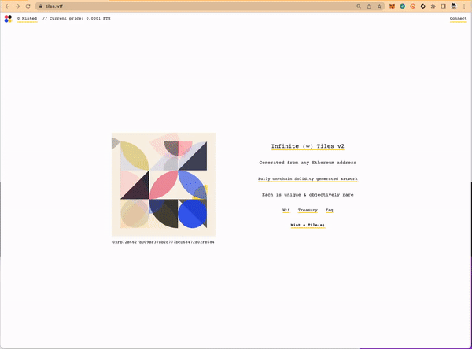
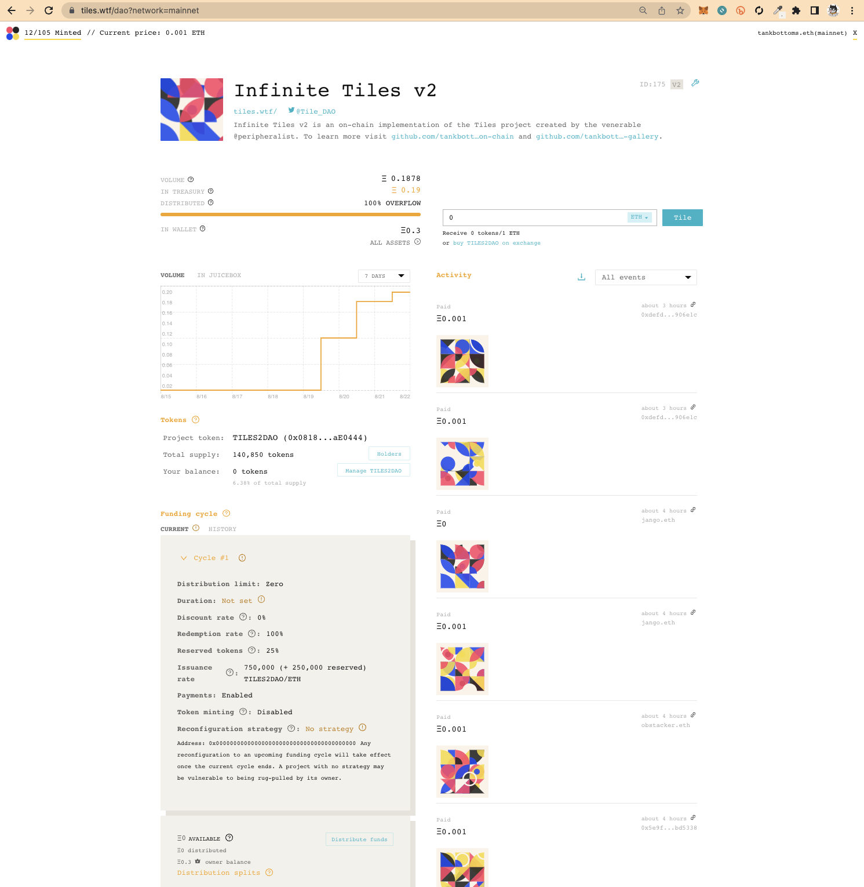

# Infinite Tiles v2 (tiles.wtf website)

<p align="center">
  <br/>
  <caption>@peripheralist's timeless, beautiful and dynamic Tiles project is reborn</caption>
</p>

#### Contracts

Infinite Tiles v2 Solidity contracts are available on [https://github.com/tankbottoms/tiles-on-chain](https://github.com/tankbottoms/tiles-on-chain).

#### About

Infinite Tiles v2 is an on-chain implementation of [@peripheralist](https://twitter.com/peripheralist)’s [TilesDAO](https://github.com/TileDAO) the [second (2nd) project on Juicebox](https://juicebox.money/#/p/tiles). The project is an homage to the venerable @peripheralist, the genius artist, developer, graph-wizard, sexy-man, person. Please send [@peripheralist](https://twitter.com/peripheralist) a Tweet telling him how awesome he is.

[Infinite Tiles v2](https://github.com/tankbottoms/tiles-on-chain) contains the Solidity contracts. The repository structure employed a composable pattern which will be familiar with anyone involved in the Juicebox NFT minting toolkit. The InfiniteTiles contract uses [Juicebox v2](https://juicebox.wtf/projects/175) terminal to forward any proceeds.

```typescript
function _payTreasury(address _tile) private {
    IJBPaymentTerminal terminal = jbxDirectory.primaryTerminalOf(jbxProjectId, JBTokens.ETH);
    if (address(terminal) == address(0)) {
      return;
    }

    (bool success, ) = address(terminal).call{value: msg.value}(
      abi.encodeWithSelector(
        terminal.pay.selector,
        jbxProjectId,
        msg.value,
        JBTokens.ETH,
        msg.sender,
        0,
        false,
        (_tile == address(0) ? '' : tokenUriResolver.externalPreviewUrl(_tile)),
        0x0
      )
    );
  }

```

#### Tiles Algorithm

The Original Tiles visual algorithm can be found [here](https://github.com/tankbottoms/tiles-wtf-gallery/blob/main/src/tiles/tilesStandalone.ts). You may enter any number of Ethereum addresses [here](https://tiles.wtf/mint?network=mainnet) and the site will render a visualization of the Tile for you. Additionally as explained in the next section a number of routes will return different encodings of the Tile with the default route `/render/:address` returning the Tile as a SVG image. i.e. [0x5d95baEBB8412AD827287240A5c281E3bB30d27E](https://tiles.wtf/render/0x5d95baEBB8412AD827287240A5c281E3bB30d27E)

#### Tiles Rendering

On idle, any Tile on Tiles.wtf enters an animation state, like Groot, upon any mouse movement, the Tile returns to its position. This was entirely the creative genius of the epic [@cookieslayer](https://github.com/webel).

<br />
<p align="center">
  
<p>
<br />

- `/render/:address` - renders the tile and returns Base64 encoded SVG.
- `/render/png/:address` - renders the tile and returns PNG.
- `/render/svg/:address` - [renders](https://tiles.wtf/render/svg/0x5d95baEBB8412AD827287240A5c281E3bB30d27E) the tile and returns SVG.
- `/render/particle/:address` - [renders](https://tiles.wtf/render/particle/0x5d95baEBB8412AD827287240A5c281E3bB30d27E) the tile and returns a particle animation, res high or low, and dark mode are optional parameters. By default light and low resolution modes are used.
- `/render/ethereal/:address` - [renders](https://tiles.wtf/render/ethereal/0x5d95baEBB8412AD827287240A5c281E3bB30d27E) the tile and returns an ethereal animation, in which each tile piece individually slowly fades away.

#### Minting

Most everything about the minting mechanics can be found at the [https://tiles.wtf/faq](https://tiles.wtf/faq?network=mainnet), if you go hard core, than you may find these [Etherscan](https://tiles.wtf/faq/etherscan) instructions exciting and useful.

#### User History, Tiles Contract History

- [All minted v2 Tiles](https://tiles.wtf/history?network=mainnet)
- [Tankbottoms.eth Tiles](https://tiles.wtf/history/0x5d95baebb8412ad827287240a5c281e3bb30d27e?network=mainnet)
- [Seizure Tiles](https://tiles.wtf/seizures?network=mainnet)

#### Juicebox v2 Treasury

In addition to minting and viewing Tiles, the full [Juicebox.money front-end](https://juicebox.wtf/projects/175) is included and fixed to the [Tiles Project Id of 175](https://juicebox.wtf/projects/175). This is easily changed. This is intended to demonstrate how a DAO would possibly present a minting experience, and possibly a open or token-gated Treasury management experience. A modification to the Activity component was made in to allow for the parsing of the SVG data provided by the smart contract during the pay-event.

<br />
<p align="center">

</p>
<br />

This Svelte [Juicebox v2 front-end](https://github.com/tankbottoms/tiles-wtf-gallery/tree/main/src/juicebox) is made available for anyone to use (see below for the fine print) with an existing Juicebox treasury.

#### Extra Token Gating Example

Tiles can be used to [TokenGate](https://github.com/tankbottoms/tiles-wtf-gallery/blob/main/src/components/TokenGated.svelte) community pages or using [GateKeeper](https://gatekeep.it/) IRL. I've started to require a Tile for even causal outings with friends.

### Build

```bash
yarn install
yarn build
yarn preview
```

### Develop

```bash
yarn install
yarn dev
```

### License

Use of the source-code is permitted for projects which route their Ethereum payments to the Juicebox Protocol. See the [fine print.](./LICENSE)

### Animation URL rendering deployments

- [QmY1bTK99UBB2bLfCmFAHcwxTv6zhf8Mq9czpnjFABeZ2s](https://ipfs.io/ipfs/QmY1bTK99UBB2bLfCmFAHcwxTv6zhf8Mq9czpnjFABeZ2s/0x5d95baEBB8412AD827287240A5c281E3bB30d27E) 20220819

---

<p align="center">
<a href="https://juicebox.wtf/disclaimers?network=mainnet">Disclaimers</a> -
<a href="http://tiles.wtf/tos?network=mainnet">Terms of Sale</a> -
<a href="https://juicebox.wtf/terms-of-service?network=mainnet">Terms of Service</a>
</p>
